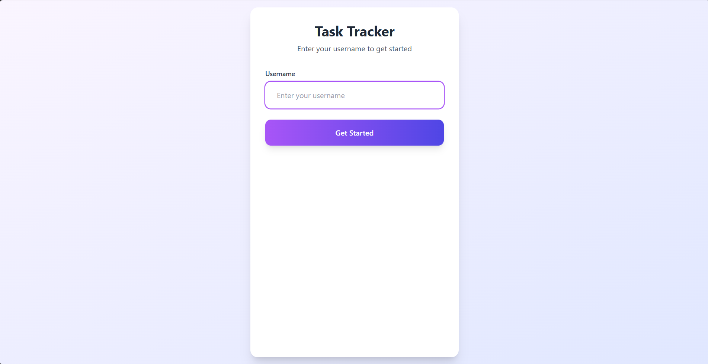
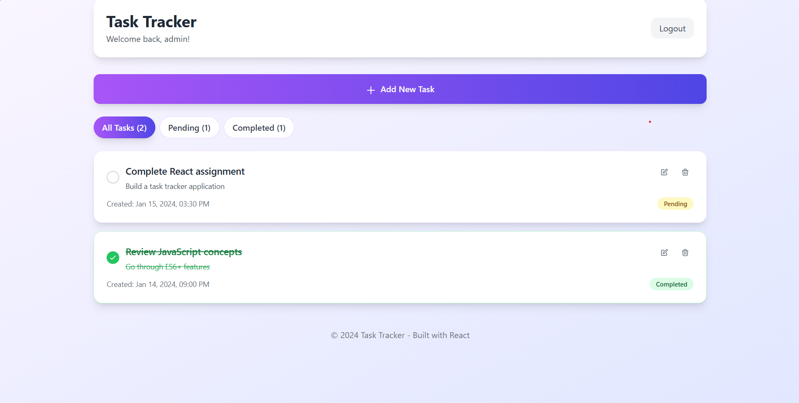
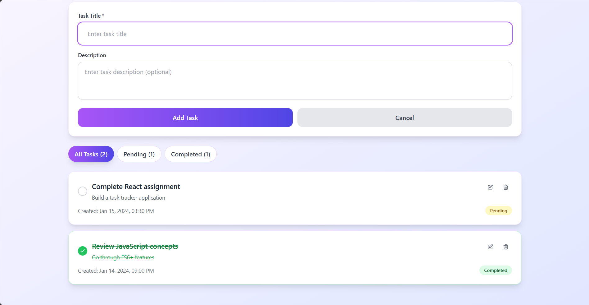
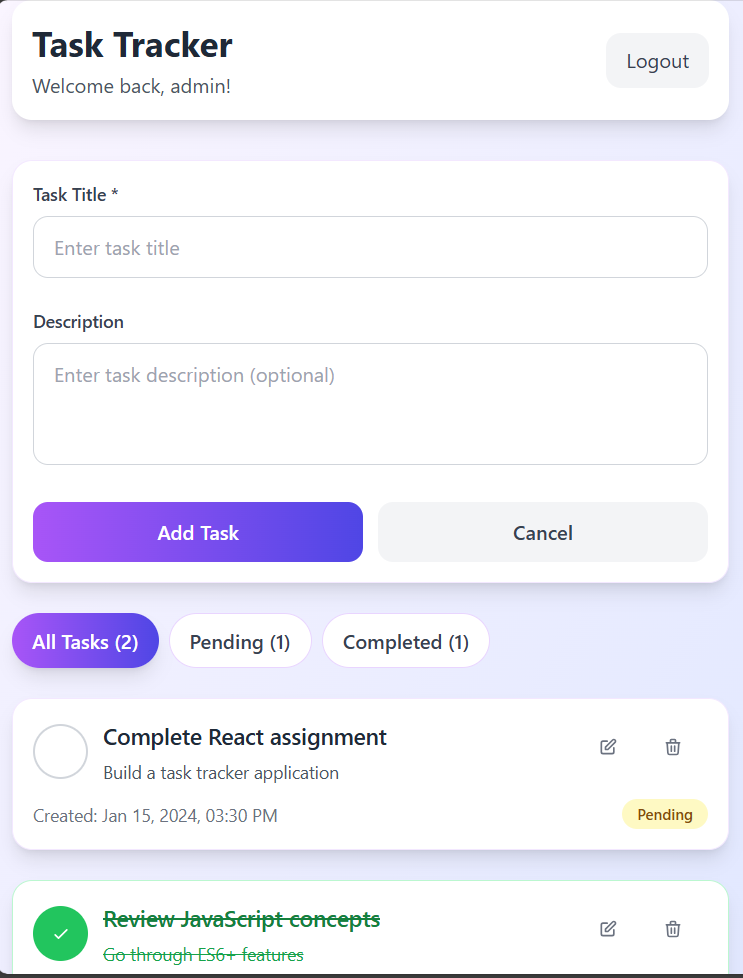

# 📋 Personal Task Management App

A **responsive, modern React.js** task management app built as a pre-hire intern assignment.  
It demonstrates React fundamentals, hooks, clean component architecture, and local storage persistence.



---

## ✨ Features

- 🔐 **Login:** Simple username login saved in localStorage (no real authentication)
- 📝 **Task CRUD:** Add, edit (inline), delete (with confirmation)
- ✅ **Status Toggle:** Mark tasks as complete/pending
- 📄 **Task Details:** Title, description, creation date/time
- 🎨 **Visual Distinction:** Completed vs. pending tasks
- 🔍 **Filter:** View All / Completed / Pending tasks, with live counts
- 💾 **Persistence:** All data saved in localStorage; survives page refresh
- 📱 **Responsive Design:** Works seamlessly on desktop & mobile

---

## 🛠 Technologies Used

- **React 19** with functional components & hooks (`useState`, `useEffect`)
- **Tailwind CSS** for styling
- **localStorage API** for data persistence
- Modern **ES6+** JavaScript features

---

## 📁 Project Structure

```plaintext
task-tracker/
├── public/
│   └── index.html
├── src/
│   ├── components/
│   │   ├── Login.js
│   │   ├── TaskForm.js
│   │   ├── TaskItem.js
│   │   ├── TaskList.js
│   │   └── TaskFilter.js
│   ├── utils/
│   │   └── localStorage.js
│   ├── styles/
│   │   └── App.css
│   ├── App.js
│   └── index.js
├── README.md
└── package.json
```

---

## 🚀 Setup & Run Locally

1. Clone the repository:
   ```bash
   git clone <repository-url>
   cd task-tracker
   ```
2. Install dependencies:
   ```bash
   npm install
   ```
3. Start the app:
   ```bash
   npm start
   ```
4. Open in browser: [http://localhost:3000](http://localhost:3000)

---

## 📸 Screenshots

| Login Page                                           | Dashboard View                                          |
| ---------------------------------------------------- | ------------------------------------------------------- |
|  |  |

| Task Management                                                | Mobile View                                            |
| -------------------------------------------------------------- | ------------------------------------------------------ |
|  |  |

---

## ✏ Component Overview

- **Login.js** – Username input & localStorage save
- **TaskForm.js** – Add/edit task form
- **TaskList.js** – Shows filtered list of tasks
- **TaskItem.js** – Single task card with toggle/edit/delete
- **TaskFilter.js** – Tabs/buttons to filter tasks
- **localStorage.js** – Helper functions to store and retrieve data

---

## 🌐 Deployment

- Live demo: [https://unique-tiramisu-4023e6.netlify.app/](https://unique-tiramisu-4023e6.netlify.app/)

To deploy:

```bash
npm run build
```

---

## 💡 Future Enhancements

- Search tasks
- Priority levels
- Due dates
- Dark mode
- Task categories
- Export/import data

---

## 🤝 Contributing

Project built as a **pre-hire intern assignment** showcasing:

- React functional components & hooks
- localStorage integration
- Clean, maintainable code
- Responsive UI

---

## 📄 License

Built for educational/demo purposes only.  
Made with ❤️ using React.js.

---
